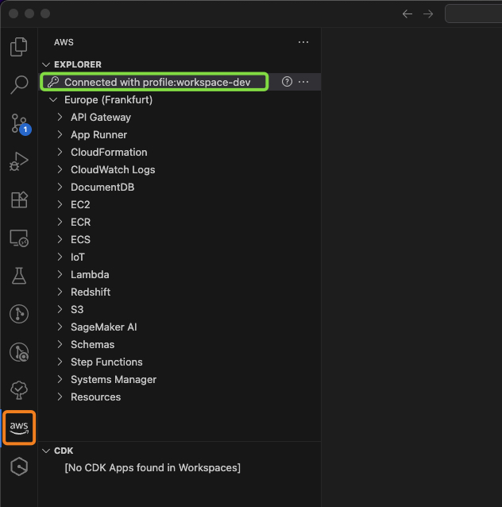
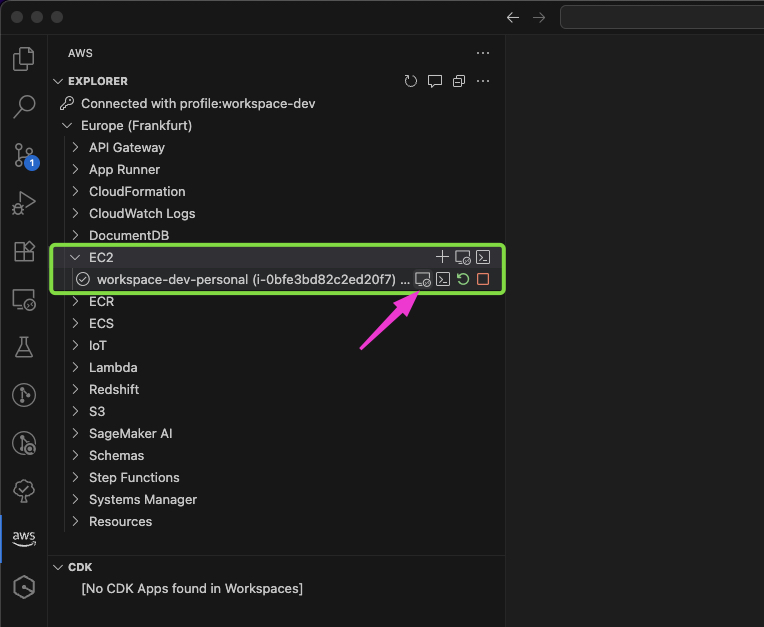
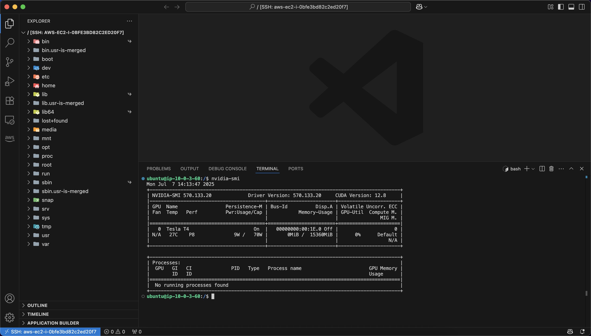
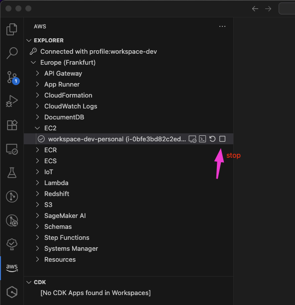
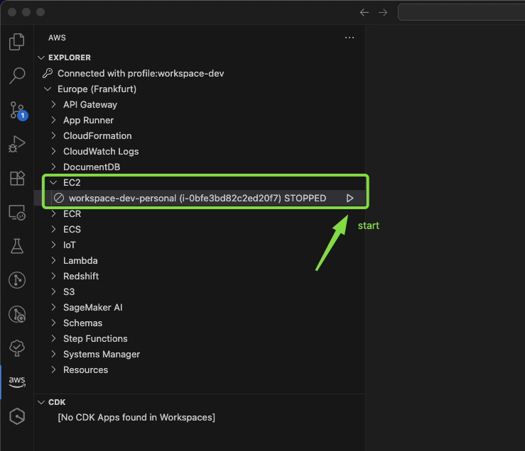

# Private & Secure AI-Ready Cloud Development Workspace


A robust, private, and secure cloud-based development environment tailored for AI/ML workloads. This workspace uses AWS EC2 with GPU support and AWS Systems Manager for seamless, secure, and credential-free access. Designed for data scientists, ML engineers, and developers who need GPU acceleration and secure remote access from anywhere.

TODO:VIDEO DEMO here possibly

## Table of Contents

- [Why this project?](#why-this-project)
- [Prerequisites](#prerequisites)
- [Getting Started](#getting-started)
- [AI/ML Development Readiness](#aiml-development-readiness)
- [Storage handling](#storage-handling)
- [Cleanup, stop and start](#cleanup-stop-and-start)

## Why this project?

Modern AI/ML workflows demand secure, high-performance, and easy-to-use development environments. This project provides:

- **Private and isolated VPC networking:** all resources are deployed in a private subnet with no public IPs, reducing exposure to the internet and lowering the attack surface.
- **Secure, keyless access via AWS Systems Manager**: developers connect to instances through Session Manager, eliminating the need to manage or store SSH keys and credentials. No open ports. No inbound traffic. Just secure, auditable, encrypted access.
- **GPU-ready EC2 instances**: easily deploy EC2 instances with GPU support (e.g., G4/G5/VT1) for accelerated training, fine-tuning, or inference tasks.
- **Simple setup using Terraform**: infrastructure is fully automated using Terraform, enabling consistent, repeatable deployments in minutes.
- **Seamless developer experience with VS Code**: integrates with the AWS Toolkit and Remote SSH extensions in VS Code for local-like development on cloud resources.
- **Cost-effective architecture**: leverages and provides support for EC2 Spot Instances to minimize costs.

## Prerequisites

Before you begin, make sure you have the following tools and configurations in place:

### AWS Account Requirements

- An **AWS Account** with sufficient permissions to create and manage the resources handled in terraform (EC2, VPC, IAM, KMS, S3...).
- **Service Quotas**: this example uses a Spot EC2 instance with a GPU-enabled type from the G family (e.g., `g4dn.xlarge`). Make sure your account has sufficient EC2 Spot vCPU quota to launch at least one such instance. If you plan to run multiple instances in parallel, ensure the quota covers the total required vCPUs. Note: for new AWS accounts, the default Spot vCPU quota for GPU instances is often **0**, so you may need to request a quota increase via the [Service Quotas Console](https://console.aws.amazon.com/servicequotas/home).

### Local Environment Setup

- [**Terraform**](https://developer.hashicorp.com/terraform/downloads) version **1.11** or higher.
- [**AWS CLI**](https://docs.aws.amazon.com/cli/latest/userguide/install-cliv2.html) properly installed and configured.
- [**Visual Studio Code**](https://code.visualstudio.com/) with:
  - [AWS Toolkit extension](https://marketplace.visualstudio.com/items?itemName=AmazonWebServices.aws-toolkit-vscode) (v3.39.0 or later)
  - [Remote - SSH extension](https://marketplace.visualstudio.com/items?itemName=ms-vscode-remote.remote-ssh)

### AWS Authentication & Named Profiles

To authenticate with AWS and allow Terraform to deploy resources on your behalf, configure the AWS CLI using a named profile:

```sh
aws configure --profile workspace-dev
```

This command will prompt you to enter your AWS Access Key, Secret Key, default region, and output format.

The Terraform configuration in this project uses a named profile (`workspace-dev`) to authenticate. If you want to change or avoid using a profile:

1. **Edit the provider block in Terraform** (`providers.tf`):

```hcl
provider "aws" {
  ...
  profile = "${var.project_name}-${var.environment}" # <- Change or remove this line
  ...
}
```

2. **To use environment variables instead**, export credentials before running Terraform:

```sh
export AWS_ACCESS_KEY_ID="your-access-key-id"
export AWS_SECRET_ACCESS_KEY="your-secret-access-key"
export AWS_DEFAULT_REGION="your-region"
```

This gives you flexibility whether you use profiles or direct environment configuration.

## Getting Started

Follow the steps below to deploy your private and secure AI-ready development environment.

### 1. Clone the Repository

```sh
git clone https://github.com/nicolaDeCristofaro/private-and-secure-ai-ready-development-workspace
cd private-and-secure-ai-ready-development-workspace
```

### 2. Decide How to Manage Terraform State

By default, Terraform stores its state locally. This is fine for quick tests or development purposes, but it's **not recommended for team environments or production** use.

#### Option 1: Local State (default)

No extra configuration is needed—Terraform will create a `terraform.tfstate` file in your working directory.  
**⚠️ Warning**: Local state is not shared, lacks locking, and can be accidentally lost or overwritten.

\*In this repo it is assumed the use of remote backend for storing state, so if you want to use local state, comment or delete the `backend.tf` file.

#### Option 2: Remote State with S3 (recommended)

This project includes a helper module to configure remote backend support. Navigate to the [`terraform-backend`](./terraform-backend/) folder and follow the setup instructions in the README to enable:

- **S3 bucket for state storage** with:
  - versioning
  - encryption
  - native state locking

Using remote state ensures safer, auditable, and team-friendly deployments.

\*In this repo it is assumed the use of remote backend for storing state, revise the `backend.tf` file and asjust it as needed.

### 3. Configure Your Environment

Ensure your AWS CLI is authenticated using a named profile (see [Prerequisites](#2-prerequisites)) or exported credentials.

### 4. Initialize Terraform

```sh
terraform init
```

If using remote state, make sure you've already configured the backend before running this command.

### 5. Apply the Infrastructure

```sh
terraform apply
```

Terraform will prompt for approval before creating the infrastructure. Expected output:

```sh
Plan: 33 to add, 0 to change, 0 to destroy.

Do you want to perform these actions?
  Terraform will perform the actions described above.
  Only 'yes' will be accepted to approve.

  Enter a value: yes
```

### 6. Connect to Your EC2 Instance via AWS Toolkit in VS Code

TODO: wait for the EC2 status check to be completed -> 3/3 checks passed > to to do command to loop over

Once your infrastructure is deployed, you can connect to the EC2 instance using the AWS Toolkit extension in VS Code.

#### Step 1: Open AWS Toolkit in VS Code

1. Click the **AWS icon** in the left sidebar to open the AWS Toolkit panel.
2. Make sure you're **logged in using the correct AWS profile** (e.g., `workspace-dev`).
   - You can verify or switch profiles using the **"Select a Connection"** button in the Toolkit panel.
   - If no connection is available, click **"Connect to AWS"** and choose your configured profile.



#### Step 2: Connect to the EC2 Instance

1. In the AWS Toolkit panel, expand the **EC2 Instances** section.
2. Locate the EC2 instance you deployed (you can filter by name or instance ID).
3. Right-click on the instance and select **"AWS: Connect VS Code to EC2 instance"**.



4. VS Code will launch a **new window** connected to the EC2 instance through **AWS Systems Manager Session Manager**.
   - This does **not** require SSH keys or public IP addresses.
   - Traffic is encrypted and routed through Systems Manager for secure and auditable access.



> **Note:** You may need to enable "Experimental Features" in the AWS Toolkit extension settings for Session Manager-based connection to EC2.

> ✅ Supported configurations:
> - EC2 instances running Linux or macOS
> - Local development on Linux or macOS (Windows currently not supported for Session Manager + VS Code integration)

## AI/ML Development Readiness

Given the growing demand for AI/ML development, this project focuses primarily on supporting development on those workloads. If your use case involves training or fine-tuning machine learning models, this setup can provision GPU-enabled EC2 instances (e.g., `g4dn.xlarge`) to accelerate your workflows.

> This workspace is ideal not only for AI/ML workloads but also for general-purpose remote development. You can choose to deploy instances with or without GPU support depending on your needs.

### Example Use Case: Fine-Tuning a Vision Model ?

TODO: describe and implement a use case OR more use cases

## Storage handling

The example code provided provisions a separate, persistent EBS volume in addition to the EC2 root volume:
- The root volume is typically ephemeral, especially when using Spot Instances, which can be terminated by AWS at any time. 
- To prevent data loss, the additional EBS volume is managed independently in Terraform and automatically formatted and mounted at instance startup.

The purpose of handling this second EBS volume separately is to ensure data persistence:
- If the EC2 instance is terminated (manually or by AWS Spot reclamation), the secondary EBS volume remains intact.
- When a new EC2 instance is created, the volume is reattached automatically, and the mount point is restored.
- This ensures you can safely store project files, model checkpoints, datasets, and logs without worrying about losing them when the compute instance is recycled (be careful to save these file under the mount point path).

The mount point for this volume is fully configurable via a Terraform variable:

```hcl
variable "ec2_workspace" {
  type = object({
    ...
    volume_size          = number
    volume_mount_point  = string
    ...
  })
}
```

By default, the volume is mounted at `/mnt/persistent-data`, but you can override this path to suit your project needs. 

The formatting, mounting, and persistence logic (including fstab configuration and permissions for the ubuntu user) are automated via a startup script (user_data), so no manual setup is required post-launch.

## Cleanup, stop and start

### Stop and Start from AWS Toolkit

You can stop and start the EC2 instance directly from the AWS Toolkit in Visual Studio Code:
1. Open the AWS Toolkit panel.
2. Locate your EC2 instance.
3. Choose Stop Instance or Start Instance as needed.





⚠️ **Important for Spot Instances**: Stopping Spot instances is not always reliable. AWS may reclaim the instance, and stopped Spot instances may not restart later.

### Complete Cleanup

To destroy all infrastructure created via Terraform:

```bash
terraform destroy
```

This will remove all resources described in the code and stored in the terraform state.

### Terminate Only EC2 and Keep EBS Volume

To terminate just the EC2 instance but keep its secondary EBS volume (for data persistence):
1. Comment out the EC2 module and the aws_volume_attachment resource in your Terraform `main.tf` file.
2.	Run:

```bash
terraform plan
terraform apply
```

- Terraform will destroy the EC2 instance but retain the EBS volume. Expected output: `Plan: 0 to add, 0 to change, 7 to destroy.`

3. To restore (re-create a new instance + EBS volume attachment):
  - Uncomment the EC2 and volume attachment resources, then re-run terraform apply.
  - The new EC2 instance will be created and the existing EBS volume reattached with all previous data intact.

